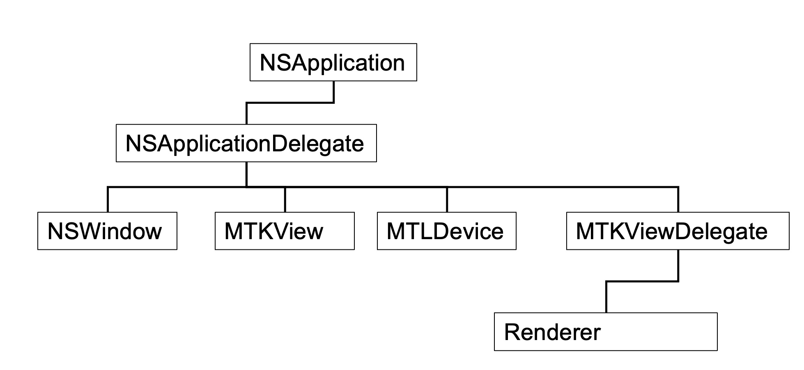

# Metal Framework

### Initial Window


With Coco applications objects are reference counted.  Objects are either
manually or automatically referenced counted.  There are additional commands
to just `new` like `alloc` and `retain` that control the referencing of an object.

There is an `autorelease pool` command that is like RAII (Resource Acquisition Is Initialization),
often referred to as Scope-Bound Resource Management (SBRM)
that has an autorelease pool when bounded with a `pool.release` command.

So our release pool looks like the following:
```c++
NS::AutoreleasePool* pAutoreleasePool = NS::AutoreleasePool::alloc()->init();
```

The application delegate is our controller:
```angular2html
    AppDelegate del;
```
## Metal Architecture
Top level control will be a Next Step application.  

To add our own behaviour
to that application a (Next Step) delegate is needed where we can apply changes.  Metal device abstracts all the things
that we can do with our graphical device (like a logical device in Vulkan).
Other objects are also created like the Next Step Window.  Metal Kit is a developer aid to help simplify
the development process.
Another delegate called the Metal View Kit Delegate will handle all the drawing.  
There is a custom renderer class where most of the rendering will take place.

Here is the code that implements some of this framework:

```c++
NS::Application* application = NS::Application::sharedApplication();
    application->setDelegate( &del );
```