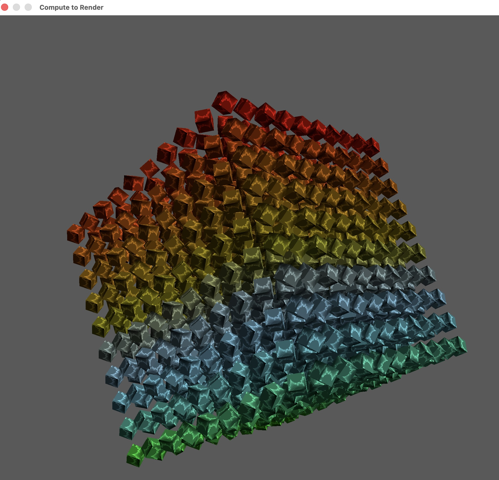

# Metal Framework

# Metal with C++
https://developer.apple.com/metal/cpp/

https://developer.apple.com/documentation/Metal/rendering-a-scene-with-deferred-lighting-in-c++



### Initial Window


With Coco applications objects are reference counted.  Objects are either
manually or automatically referenced counted.  There are additional commands
to just `new` like `alloc` and `retain` that control the referencing of an object.

There is an `autorelease pool` command that is like RAII (Resource Acquisition Is Initialization),
often referred to as Scope-Bound Resource Management (SBRM)
that has an autorelease pool when bounded with a `pool.release` command.

So our release pool looks like the following:
```c++
NS::AutoreleasePool* pAutoreleasePool = NS::AutoreleasePool::alloc()->init();
```

The application delegate is our controller:
```angular2html
    AppDelegate del;
```
## Metal Architecture
Top level control will be a Next Step application.  

To add our own behaviour
to that application a (Next Step) delegate is needed where we can apply changes.  Metal device abstracts all the things
that we can do with our graphical device (like a logical device in Vulkan).
Other objects are also created like the Next Step Window.  Metal Kit is a developer aid to help simplify
the development process.
Another delegate called the Metal View Kit Delegate will handle all the drawing.  
There is a custom renderer class where most of the rendering will take place.

Here is the code that implements some of this framework:

```c++
NS::Application* application = NS::Application::sharedApplication();
    application->setDelegate( &del );
```

The application delegate manages a window, view, device and a view delegate.  A delegate gets
a message passed to the application.

```c++
class AppDelegate : public NS::ApplicationDelegate
{
public:
    ~AppDelegate();

    NS::Menu* createMenuBar();

    virtual void applicationWillFinishLaunching( NS::Notification* pNotification ) override;
    virtual void applicationDidFinishLaunching( NS::Notification* pNotification ) override;
    virtual bool applicationShouldTerminateAfterLastWindowClosed( NS::Application* pSender ) override;

private:
    NS::Window* _pWindow;
    MTK::View* _pMtkView;
    MTL::Device* _pDevice;
    MyMTKViewDelegate* _pViewDelegate = nullptr;
};
```

Here we have defined the size and position of the window:

```c++
void AppDelegate::applicationDidFinishLaunching( NS::Notification* pNotification )
{
    CGRect frame = (CGRect){ {100.0, 100.0}, {512.0, 512.0} };

    _pWindow = NS::Window::alloc()->init(
        frame,
        NS::WindowStyleMaskClosable|NS::WindowStyleMaskTitled,
        NS::BackingStoreBuffered,
        false );

    _pDevice = MTL::CreateSystemDefaultDevice();

    _pMtkView = MTK::View::alloc()->init( frame, _pDevice );
    _pMtkView->setColorPixelFormat( MTL::PixelFormat::PixelFormatBGRA8Unorm_sRGB );
    _pMtkView->setClearColor( MTL::ClearColor::Make( 1.0, 0.0, 0.0, 1.0 ) );

    _pViewDelegate = new ViewDelegate( _pDevice );
    _pMtkView->setDelegate( _pViewDelegate );

    _pWindow->setContentView( _pMtkView );
    _pWindow->setTitle( NS::String::string( "00 - Window", NS::StringEncoding::UTF8StringEncoding ) );

    _pWindow->makeKeyAndOrderFront( nullptr );

    NS::Application* pApp = reinterpret_cast< NS::Application* >( pNotification->object() );
    pApp->activateIgnoringOtherApps( true );
}
```

Note the following line that creates the view delegate `_pViewDelegate = new ViewDelegate( _pDevice )` 

Functions within the `ViewDelegate`:

```c++
ViewDelegate::ViewDelegate( MTL::Device* pDevice ) : MTK::ViewDelegate(), _pRenderer( new Renderer( pDevice ) )
{
}

ViewDelegate::~ViewDelegate()
{
    delete _pRenderer;
}

void ViewDelegate::drawInMTKView( MTK::View* pView )
{
    _pRenderer->draw( pView );
}
```

The renderer is defined as:

```c++
class Renderer
{
public:
    Renderer( MTL::Device* pDevice );
    ~Renderer();
    void draw( MTK::View* pView );

private:
    MTL::Device* _pDevice;
    MTL::CommandQueue* _pCommandQueue;
};
```

Note that the `CommandQueue` contains all the drawing commands that will be sent to the
GPU.  This is created in our constructor:

```c++
Renderer::Renderer(MTL::Device* pDevice ): pDevice( pDevice->retain()) {
    pCommandQueue = pDevice->newCommandQueue();
}
```
The command queue is made up of objects from the command buffer.  You can have more than one
command queue per device for different commands like rendering.  The `RenderPassDescriptor` describes
all the resources that will be accessed or modified (read or written too). The `RenderCommandEncoder` is responsible
for recording drawing commands.
